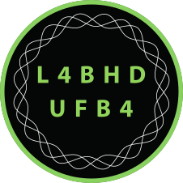

```{r start}
#| echo: false
reticulate::use_virtualenv("uv_nlp_314")
```



# Sobre mim 

Formado em Sociologia pela UFMG, vem atuando com ciência social computacional, análise textual computacional e Processamento de Linguagem Natural, autor de pacotes no R, usuário de Linux desde 2013 e defensor de Neovim e do i3wm.

{.absolute bottom=280 right=100 width="100" height="100"}

 

 

 

 


# Contatos 

- <https://github.com/SoaresAlisson?tab=repositories>
- <https://www.linkedin.com/in/alisson-soares-7b01621bb/>
- <https://fosstodon.org/@alissonmasoares>


## Telegram 
https://t.me/pythonmg  
https://t.me/rbrasiloficial   
https://t.me/R_humanidades  
https://t.me/bhlivre  
Eventos Tech BH https://t.me/eventos_tech_bh  
https://t.me/nvimbr  


# Referencias 


