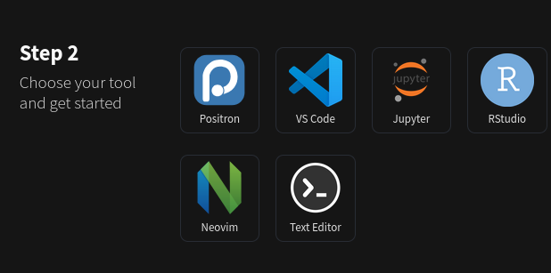

Acessar objetos R no Python com `r.`

```{r nova variavel do R}
from_r <- "Olá, sou uma string originária do R."
from_r
```
```{python print var do R}
print(r.from_r.upper())
print(r.from_r.rsplit())
```

## Salvando objetos Python a partir do R 
Utilizando [Pickle](https://docs.python.org/3/library/pickle.html).
```{r }
#| eval: false
py_save_object(objeto, nome_de_arquivo, ...)
py_load_object(nome_de_arquivo)
```


# Quarto


https://quarto.org/

## instalação 
```{bash quarto install arch}
#| eval: FALSE
yay -S quarto-cli-bin # ArchLinux
```
Opção 2
```{bash quarto install git}
#| eval: FALSE
git clone https://github.com/quarto-dev/quarto-cli
cd quarto-cli
./configure.sh
```
Opção 3
```{bash quarto install wget}
#| eval: FALSE
# --- https://quarto.org/docs/download/tarball.html
wget https://github.com/quarto-dev/quarto-cli/releases/download/v1.8.25/quarto-1.8.25-linux-amd64.tar.gz
mkdir ~/opt
tar -C ~/opt -xvzf quarto-1.8.25-linux-amd64.tar.gz
mkdir ~/.local/bin
ln -s ~/opt/quarto-1.8.25/bin/quarto ~/.local/bin/quarto
(
  echo ""
  echo 'export PATH=$PATH:~/.local/bin\n'
  echo ""
) >>~/.profile
source ~/.profile
quarto check
```

quarto render report.qmd --to html
quarto render report.qmd --to docx

## Sintaxe básica 

````verbatim
---
title: O meu título
format: pdf
---

Veja este meu código Python
```{{python}}
1+1 
```

Veja este meu código em R
```{{r}}
1+1
```
````

---

````verbatim
---
title: O meu título
subtitle: Utilizando pacotes Python no R com o Reticulate
author: Fulano de tal
date: 3/12/26
abstract: Lorem ipsum... 
logo:
  alt: FliSoL 
format:
  revealjs:
    slide-number: true
    transition: slide
    incremental: true   
    scrollable: true
    preview-links: auto
    #theme: dark
    footer: 'FlISoL 2026 - "Python _versus_ R? Python no R!" - Alisson Soares'
css: style.css
---

```{{python}}
#| eval: false
1+1 
```

```{{r }}
#| echo: true
1+1
```

````


## Extensões, plugins para rodar Quarto



IDE Positron - fork VS Code: https://positron.posit.co/  
Extensão VS Code: https://quarto.org/docs/tools/vscode/index.html  

Extensão nvim:  
- https://quarto.org/docs/tools/neovim.html  
- https://github.com/R-nvim/R.nvim  


## Jupyter <--> Quarto 
```{bash jupyter convert}
#| eval: false
# Converter de quarto para ipynb:
quarto convert class_notes.qmd

# Converter de ipynb para quarto:
quarto convert class_notes.ipynb 

quarto render class_notes.ipynb
```

## Quarto: adicionando plugins
https://quarto.org/docs/extensions/managing.html 

No diretório do projeto atual
```{bash add plugin}
#| eval: false
quarto add andrewheiss/language-name
```

--- 

```{bash}
#| eval: FALSE
quarto list extensions 
quarto update quarto-ext/fontawesome
quarto remove quarto-ext/fontawesome
```

# Contatos 

## Telegram 
https://t.me/R_humanidades  
https://t.me/rbrasiloficial   
https://t.me/pythonmg  


