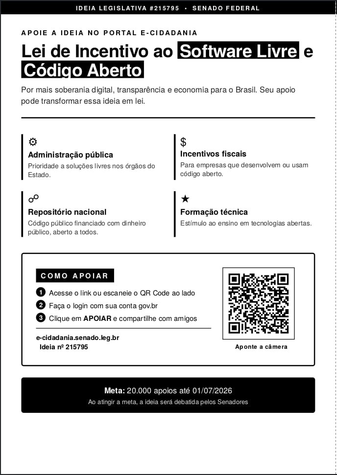

# Lei de Incentivo ao Software Livre e Código Aberto!

Essa proposta busca fortalecer a soberania digital do Brasil, reduzir gastos com licenças de software, incentivar a inovação nacional e aumentar a transparência no uso de sistemas públicos.
Ao priorizar soluções de código aberto, o poder público economiza recursos, estimula startups e desenvolvedores brasileiros e garante mais segurança e autonomia tecnológica.
Vote e ajude a transformar essa ideia em debate oficial no Senado.
Seu apoio faz a diferença!

<https://www12.senado.leg.br/ecidadania/visualizacaoideia?id=215795>

--- 

