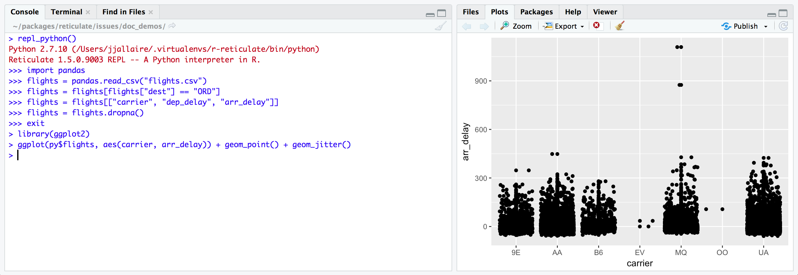

# O pacote Reticulate {background-image="img/reticulate.jpg" background-opacity=0.5} 


 <https://rstudio.github.io/reticulate/index.html>


## ambientes virtuais
O reticulate usa a versão do Python que estiver no seu PATH (`R: Sys.which("python")` ou bash: `which python`).
Para especificar qual Python env o Reticulate deve utilizar, usar:

- use_python() 
- use_python_version() 
- use_virtualenv()
- use_condaenv() 
- use_miniconda()

https://rstudio.github.io/reticulate/articles/versions.html

---

```{r load libs reticulate}
library(reticulate)
# utilizando meu env UV que está na pasta virtualenv
use_virtualenv("uv_nlp_314")
```

. . .

```{r testando python}
# informações sobre a versão Python utilizada 
py_config()

# Qual Python está sendo utilizado:
reticulate::py_config()$python
```

---

```{r py_eval 1+1}
# rodando algo em Python a partir do R
reticulate::py_eval("1+1")
reticulate::py_eval("3 ** 2")
```

## Obtendo ajuda
```{r py help}
#py_help("print")

os <- import("os")
py_help(os$chdir)
```
## checando se módulos/pacotes estão instalados
```{r py_module_available}
py_module_available("numpy")
py_module_available("xyz")

```

## sourcing 
Sourcing Scripts. Dado o script `add.py`:

```{verbatim add.py}
# conteúdo do arquivo
def add(x, y):
  print("the sum of", x, "and", y, "is", x+y)

```
. . .

Chamando-o de dentro do R
```{r r:add.py}
#| echo: true
source_python('add.py')
add(5, 10)
```

## Executando código 
A partir de arquivo
```{r run file}
#| eval: false
library(reticulate)

py_run_file("meu_script.py")
```
. . .

Rodando Python diretamente do R
```{r run_string}
py_run_string("x = 10 + 10")
py_run_string("print(x)")
```
. . .
```{r run_string 2}
py_run_string('import os')
py_run_string('arquivos = os.listdir(".")')
py_run_string('print(arquivos)')

```
--- 


--- 

:::: {.columns}
::: {.column width="50%"}
```{python }
import os
os.listdir(".")
```
:::
::: {.column width="50%"}
```{r listdir}
# Python: import os as os
os <- import("os")
os$listdir(".")
```
:::
::::

## Objetos

Acessar objetos do Python no R com `reticulate::py$` ou `py$`

```{python atribuindo variável}
from_py = "Olá! Sou um valor vindo do Python"
print(from_py)
```
. . .

```{r variavel py to r}
varia <- py$from_py
```
. . .
```{r testando a variável no R}
varia

varia |> toupper()
strsplit(varia, " ")

varia |>
  gsub(x = _, "Sou", "Eu era") |>
  paste0(x = _, ". Mas agora estou dentro do R!")
```
---

Setando variável Python a partir do R
```{r }
py$var <- "nova variável a partir do R"
```
```{python py_print var}
print(var)
```

---

Acessar objetos R no Python com `r.`

```{r nova variavel do R}
from_r <- "Olá, sou uma string originária do R."
from_r
```
```{python print var do R}
print(r.from_r.upper())
print(r.from_r.rsplit())
```

## Salvando objetos Python a partir do R 
Utilizando [Pickle](https://docs.python.org/3/library/pickle.html).
```{r }
#| eval: false
reticulate::py_save_object(objeto, nome_de_arquivo, ...)
reticulate::py_load_object(nome_de_arquivo)
```

## Pandas 

### Do Python para R
```{python pandas para R}
import pandas as pd
df = pd.read_csv("flight_data.csv")

print(df)
print(df.columns)
df.info()

df_filtered = df[df["month"] == 4]

df2 = (df_filtered.groupby("day")["distance"]
          .sum()
          .reset_index(name="distancia_somada")
       .reset_index())
print(df2)

```
ou ainda
```{python py flight_data.csv}
(df2 := pd.read_csv("flight_data.csv")
   .pipe(lambda x: x[x["month"] == 4])
   .groupby("day")["distance"]
   .sum()
   .reset_index(name="distancia_somada")
)
```

--- 

```{r ggplot2 flight_data.csv}
library(ggplot2)

py$df2 |>
  py_to_r() |>
  as.data.frame() |>
  dplyr::mutate(day = as.factor(day)) |>
  ggplot(aes(day, distancia_somada)) +
  geom_col() +
  geom_label(aes(label=distancia_somada)) +
  labs(title = "Distância somada por dia, no mês 04, ano 2013")

```

## De R para Python 

```{r flight_data.csv dplyr}
library(tidyverse)

df_r <- read_csv("flight_data.csv") |>
  filter(month == 4) |>
    group_by(day) |>
    summarise(distancia_somada = sum(distance))

df_r
```
```{python r.df_r}
print(r.df_r)
```

## Python REPL
De dentro do terminal R, entra no modo interativo com Python com `repl_python()`


